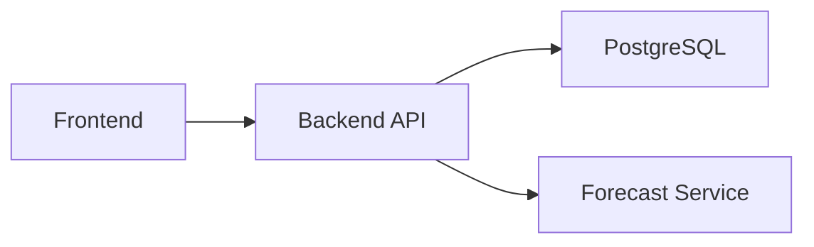

# ADR-002: Separate API and Forecast Service

- Status: Accepted
- Date: 2026-04-07

## Context

The application needs to expose a product-facing API while also running forecasting logic that is:

- computationally different from CRUD and dashboard reads
- easier to reason about when isolated
- likely to evolve model-by-model over time

The repository constraints also explicitly call for a separate Python microservice for forecasting.

## Decision

Keep forecasting in a dedicated FastAPI service and let the backend API orchestrate it over HTTP.

The backend API remains responsible for:

- assembling historical signals from SQL
- deciding scope and target resolution
- persisting forecast runs and values
- translating downstream failures into product-facing API behavior

The forecast service remains responsible for:

- model execution
- fallback behavior
- validation metrics and forecast metadata

## Decision Diagram

## Rationale

- keeps forecasting logic out of the general API service layer
- makes model-oriented code easier for a data-science-adjacent team to inspect
- preserves one product-facing backend surface for the UI
- avoids letting the frontend own persistence and orchestration concerns

## Consequences

### Positive

- clearer separation of responsibilities
- easier to evolve forecast internals independently
- backend retains auditability through persisted run metadata

### Negative

- adds service-to-service latency and failure modes
- synchronous orchestration means forecast runtime is still user-visible
- local troubleshooting spans two Python services instead of one

## Demo Assumptions

- forecast calls are synchronous
- HTTP between services is sufficient
- modest runtime scale is acceptable

## Production-Grade Note

A production-grade version might preserve the separation but introduce asynchronous execution, job management, model observability, and stronger lifecycle controls around long-running or heavier forecast requests.
