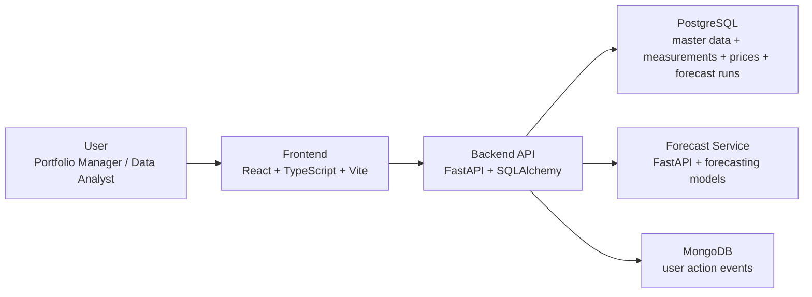

# Architecture Overview

## Purpose

This section documents the architecture of the Energy Monitor demo as it is implemented today, not as a generic future target.

The intended readers are:

- CIO or sponsor who needs a clear view of system shape, scope, and demo assumptions
- senior engineer who needs to understand service boundaries, runtime behavior, and main trade-offs quickly

## What Lives Here

- [System context](./system-context.md): product boundary, primary actors, core business capabilities, and demo-vs-production assumptions
- [Runtime and deployment view](./runtime-deployment-view.md): local `docker compose` topology, startup behavior, and operational boundaries
- [Application and data flows](./application-data-flows.md): end-to-end read, forecast, and tracking flows across frontend, API, databases, and forecast service

## Relationship With Lower-Level Docs

These architecture docs intentionally stay high-level.

For implementation detail, use:

- [backend README](../../backend/README.md)
- [backend service boundaries](../backend/service_boundaries.md)
- [backend logging and errors](../backend/logging_and_errors.md)
- [frontend README](../../frontend/README.md)
- [frontend design system](../frontend/design_system.md)
- [frontend state management](../frontend/state_management.md)

## Current System Snapshot

## Scope Statement

The current implementation is a local multi-service demo for:

- visualizing synthetic energy production and market price data
- comparing actual and forecast signals
- running on-demand forecasts
- tracking relevant user actions

It is deliberately optimized for:

- local reproducibility
- explainability in demos
- incremental engineering changes

It is not positioned as a production-grade platform, operational control room, or compliance-ready system.
