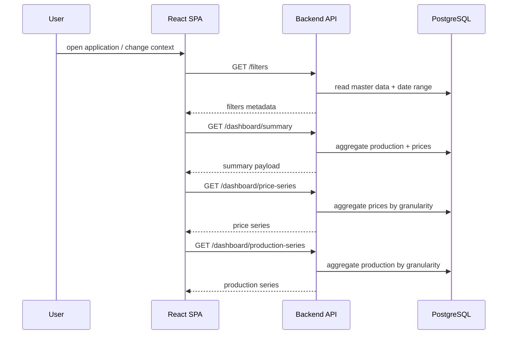
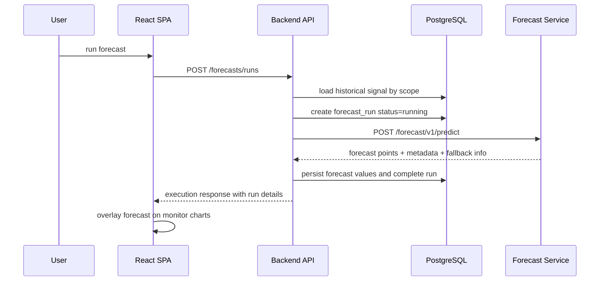
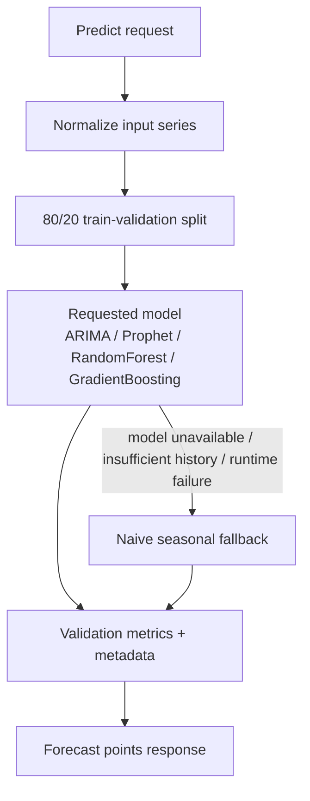
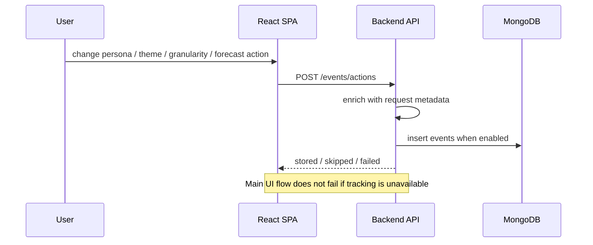

# Application and Data Flows

## Intent

This document describes the main end-to-end flows that make the current system valuable:

- dashboard read
- forecast execution
- user action tracking

The emphasis is on runtime collaboration between components, not on code-level implementation detail.

## 1. Dashboard Read Flow

The frontend shell loads filter metadata first, then requests the dashboard signals it needs for charts and KPI panels.

### What Matters Architecturally

- source data remains quarter-hourly in storage
- hourly data is derived on query, not pre-materialized as a second source of truth
- the frontend owns rendering state, but aggregation semantics stay server-side
- one SPA shell composes different persona views from the same backend domain services

## 2. Forecast Execution Flow

The main forecast flow is intentionally API-led, not direct-from-frontend to the forecast microservice.

That choice keeps the backend responsible for:

- historical signal assembly
- run persistence
- error translation
- traceability metadata

### Scope Resolution As Implemented Today

- price forecast is currently portfolio-scoped
- production forecast can be portfolio-scoped
- production forecast can also target a zone
- production forecast can also target a single plant

This is already real in the current app shell because the `Data Analyst` view can drive zone or plant forecast context.

## 3. Forecast Model Execution Inside the Forecast Service

The forecast service receives a normalized historical series rather than raw database access.

### Architecturally Relevant Details

- forecasting logic is isolated from the API backend
- fallback is explicit and returned in metadata
- validation metrics are computed as part of the request flow
- the design favors readability and demo traceability over enterprise ML complexity

## 4. User Action Tracking Flow

Tracking is intentionally best-effort.

## 5. Data Ownership Summary

| Data | Owner | Why |
|---|---|---|
| plant master data | PostgreSQL | relational domain reference data |
| production actuals | PostgreSQL | analytical joins and time-series aggregation |
| market prices | PostgreSQL | same business domain as dashboard and forecast history |
| forecast runs | PostgreSQL | product-facing domain artifact with audit value |
| forecast values | PostgreSQL | tied to forecast runs and chart overlays |
| user action events | MongoDB | flexible event payloads and looser schema evolution |

## Demo Assumptions Vs Production-Grade Expectations

### Demo assumptions

- forecast execution is synchronous from the user perspective
- dashboard reads operate directly on the demo relational store
- telemetry storage failure is acceptable as long as the product flow continues
- local service-to-service HTTP is sufficient

### Production-grade expectations

- forecast execution would likely move to asynchronous orchestration for heavier load
- read optimization might require caching, pre-aggregation, or dedicated serving patterns
- tracking might evolve toward session analytics or event streaming
- stronger cross-service observability would be required to correlate frontend actions, API calls, and model runs
