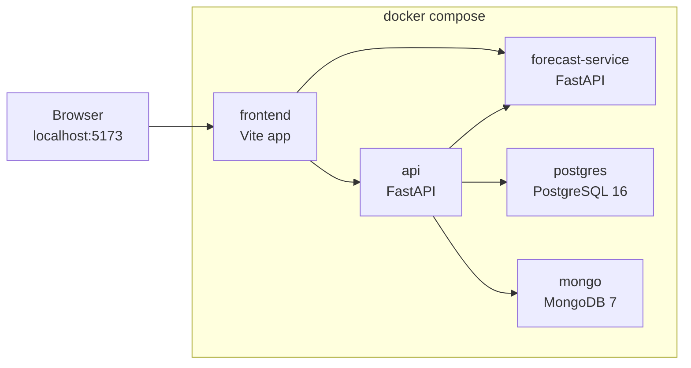
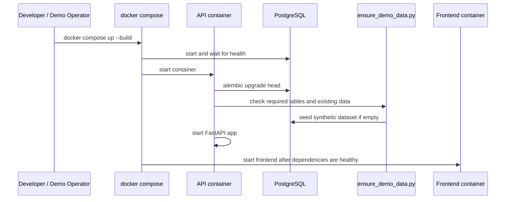

# Runtime and Deployment View

## Intent

The runtime topology is intentionally simple: everything required by the application runs locally inside containers and is started through one `docker compose` file.

This is a conscious demo choice because it keeps setup friction low and makes cross-stack walkthroughs reliable.

## Runtime Topology

## Service Responsibilities

### Frontend

- serves the React application
- orchestrates user interactions and display state
- calls the backend API for business data
- posts user action tracking through the backend
- can call the forecast service base URL from configuration, but the main forecast flow currently goes through the backend API

### Backend API

- exposes the product-facing REST API
- resolves filters and dashboard reads
- aggregates source data from SQL at query time
- orchestrates forecast execution
- persists forecast run lifecycle and output points
- enriches and stores telemetry events through MongoDB when enabled

### Forecast Service

- exposes a narrow prediction contract at `POST /forecast/v1/predict`
- runs forecast models over a supplied historical series
- returns forecast points, processing metadata, and fallback information

### PostgreSQL

- stores plant master data
- stores production measurements
- stores market prices
- stores forecast runs
- stores forecast values

### MongoDB

- stores user action events
- is optional from a product-flow perspective because tracking degrades safely when unavailable

## Startup Behavior

The local runtime is more than “start containers”.

The API container performs this bootstrap sequence:

1. run Alembic migrations
2. run `scripts/ensure_demo_data.py`
3. start `uvicorn`

That means the stack self-initializes the relational schema and seeds the synthetic dataset when SQL tables are empty.

## Startup Sequence Diagram

## Demo Assumptions

- one local operator owns startup and troubleshooting
- service discovery is static and container-local
- secrets are demo defaults or local environment variables
- no external identity provider, message bus, or observability platform is required

## Production-Grade Gap

This runtime view should not be confused with a deployment target.

A production-grade version would usually add or replace:

- container orchestration instead of local compose
- environment-separated configuration and secrets management
- ingress, TLS, authn/authz, and network controls
- metrics, tracing, and centralized logs
- backup and recovery posture for both SQL and document storage
- asynchronous or queued forecast execution for load isolation
