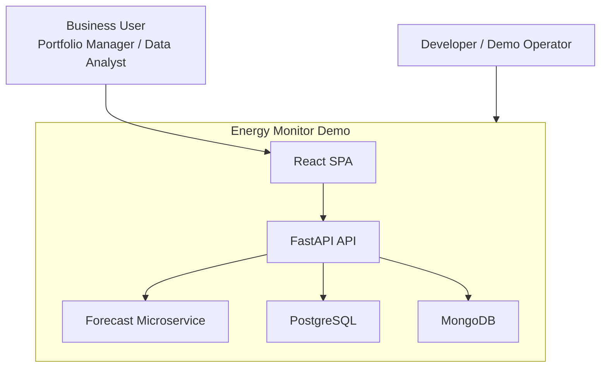

# System Context

## Executive Summary

Energy Monitor is a local full stack demo that combines:

- a single-page dashboard for two personas
- a transactional API backend
- a dedicated forecasting microservice
- relational persistence for operational domain data
- document persistence for user action telemetry

The system is designed to show a credible product slice and a disciplined engineering process, not to simulate the full scope of an enterprise energy platform.

## Primary Actors

- `Portfolio Manager`
  Focuses on compact monitoring, KPI readout, and quick forecast triggering.
- `Data Analyst`
  Uses a more exploratory chart configuration, configurable KPI tiles, and advanced forecast settings.
- `Developer / Demo Operator`
  Runs the stack locally with `docker compose`, seeds demo data automatically, and validates the services through tests and health checks.

## System Context Diagram

## Business Capabilities Implemented Today

- load filter metadata from backend-managed master data
- display price and production history at `15m` or `1h`
- show actual and forecast as visually distinct series
- run forecast requests on demand from the UI
- persist forecast runs and forecast values
- track selected UI actions server-side with non-blocking behavior

## Current Full Stack Reality

The implemented web app is not just a static dashboard:

- the frontend calls the API for filters, summary metrics, production series, price series, and forecast execution
- the backend aggregates source data from PostgreSQL instead of serving prebuilt hourly tables
- the backend persists forecast runs before and after remote forecast execution
- the forecast service executes statistical or ML-oriented models and can fall back to a naive seasonal strategy
- user action tracking is posted by the frontend and persisted to MongoDB through the backend when enabled

## Demo Assumptions Vs Production-Grade Expectations

| Topic | Demo Assumption Today | Production-Grade Expectation |
|---|---|---|
| Runtime | single local machine via `docker compose` | multi-environment deployment, orchestration, release process |
| Users | implicit local access | identity, authentication, authorization, audit controls |
| Data | synthetic, plausible, limited history | governed source integrations, data quality SLAs, lineage |
| Forecasting | on-demand, synchronous API orchestration | capacity planning, asynchronous runs, stronger monitoring and model governance |
| Availability | developer-operated local stack | operational ownership, SLOs, alerting, backup and recovery |
| Security | local-only posture and limited CORS | secrets management, IAM, network segmentation, hardening |
| Observability | structured logs and health endpoints | centralized logs, metrics, tracing, runbooks |

## Important Clarification

Some earlier specifications describe the `Data Analyst` view as temporarily similar to the `Portfolio Manager` view.

The current implementation has already moved beyond that baseline:

- `Portfolio Manager` uses two monitor panels plus fixed KPI tiles
- `Data Analyst` uses a dual-axis `Price-Plant` panel, configurable KPI slots, single-plant selection, and advanced forecast settings

That distinction is meaningful architecturally because it drives different frontend state and different forecast-scope selection, even though both personas still share one SPA shell.
